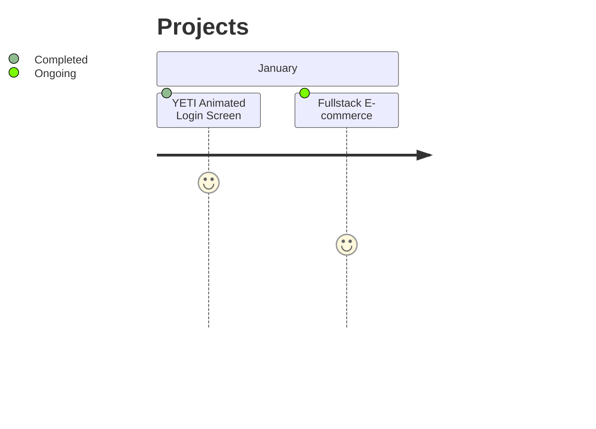

 
  
  
  
  
  
  
   

<h1 align="center">FULLSTACK DEVELOPER JR.</h1>

<h2 align="center">Hi 👋, I'm Matheus Freitas</h2>

- Backend:
   - RESTful (JAVA, SPRING);
   - AWS;
   - RabbitMQ;
- Frontend:
   - AngularJS (CSS, HTML, JS, TS);
- I'm currently arresting Kotlin!

 

<strong> Contact: </strong>

 
  
    

 

